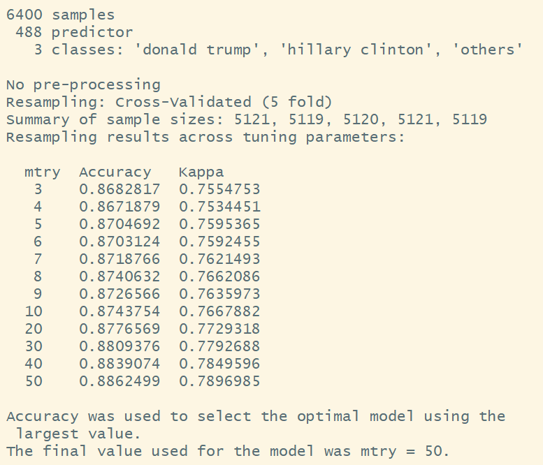

# Random forest

Random forest is based on the idea of aggregating a set of randomly grown tree, and aggregate the results of multiple predictors gives a better prediction than the best individual predictor, and lower the variance at the same time. We used random forest on 2016 presidential election data to make an more accurate prediction and to determine variable importance. 

There are 3 tuning parameter to be determined when fit Random Forest, which are number of features chosen for each tree (**m**), number of tree to be grown in the forest (**ntree**), and number of maximum node in each tree (**max node**). We've used a 3-step cross validation to find the best number of each of the three tuning parameters.

The time complexity for random forest  is O(v * n * log(n)), where v is the number of variables, and n is the number of observations. Due to the limited computing power on researcher's PC, the cross validation has been limited to 5 folds, and in each cross validation test, only 10 to 20 value of each parameter has been tested.

In step 1, number of features chosen for each tree (**m**) has been determined by cross validation:

Cross validation determined that m = 110 provide the highest cross validated accuracy. This step along took the computer over 6 hours to run.

To interpret the model, we used logistic regression with 20 most important features as determined by Random Forest.