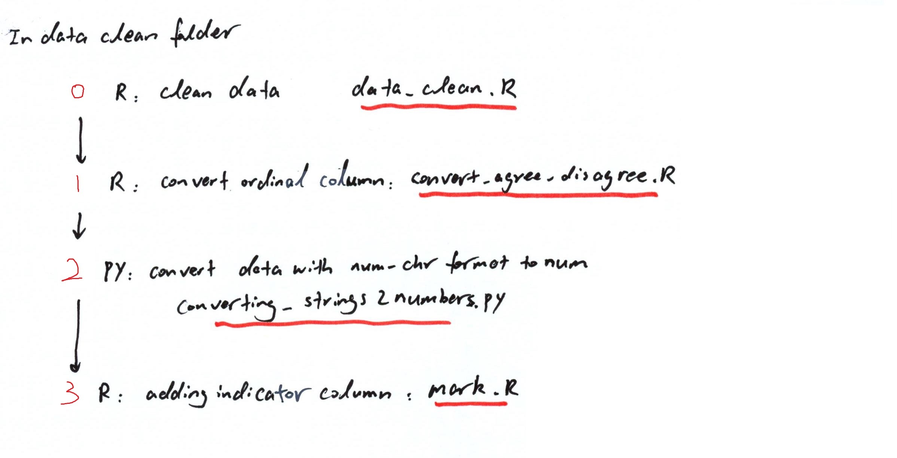

# 5220-project

[project google folder](https://drive.google.com/drive/folders/1a3j_0lgygyUjZYWuUAzN1wfC-h5im47_?usp=sharing_eip&ts=5c968193)

### Index

+ [original data](markdown_files/original_data.zip)

+ [Step 0: clean data](data_clean/data_clean.R)
  + In this step, we first manually dropped some variables: [dropped variables](data_clean/delete_variable_identified_by_floris.txt)

  + Then cols over 50% value are NA or "don't know" ~~and rows with over 25% value are NA or "don't know"~~ are dropped

+ [Step 1: convert ordinal cols](data_clean/convert_agree_disagree.R): after find variable selection, this file need to be revisited to check number-value pair of ordinal variables

  + In this step, we used key words to find all potential ordinal data

  + Then ordinal data are converted to numerical values, with negative number representing negative feedbacks (e.g. disagree, disapprove, worsen situation), and positive number standing for positive feedbacks

  + NA and don't know are replaced with neutral number (i.e. 0 in this case), and a missing indicator column is added for each column with NA

  + [data saved as csv step1_voter for processing in next step](data_clean/step_voter.zip)

+ [Step 2: convert string to numbers](data_clean/converting_strings2numbers.py)

  + this step is in python, and data processed is [saved in csv as step2_voter](data_clean/step_voter.zip)

+ [Step 3: adding missing/don't know mark column](data_clean/mark.R)

  + [this is the data after processing step 3](data_clean/step3.rda)
  
+ [Step 4: spread categorical data (one hot encoding) and split into train / test set](spread_and_impute/spread.R)

  + [train and test set](spread_and_impute/train_test.rda)

[Additional Step: summary stats](summary_stats/summary_stats.Rmd)
